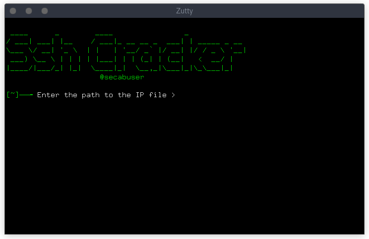

# SSH Cracker

A Python-based tool for multi-threaded SSH cracking, designed for efficiency and ease of use. This script allows testing multiple IPs, ports, usernames, and passwords, while featuring colorful outputs and detailed logging for successful, failed, and inaccessible credentials.



## Features
- **Multi-threaded Testing:** Quickly scan multiple IPs with configurable thread limits.
- **Detailed Logging:** Outputs results to separate log files for success, errors, and no access.
- **User-Friendly Interface:** Clear, colorful, and interactive console interface.
- **Asynchronous Logging:** Ensures smooth performance without delays.

## Requirements
- Python 3.x
- Required libraries:
  - `paramiko`
  - `pyfiglet`
  - `colorama`

Install dependencies using:
```bash
pip install -r requirements.txt
```

---

## How to Use

### Linux
#### Step 1: Install Prerequisites
1. Check if Python 3.x is installed:
   ```bash
   python3 --version
   ```
2. If Python is not installed, install it using your package manager:
   ```bash
   sudo apt update
   sudo apt install python3 python3-pip
   ```
3. Install the required libraries:
   ```bash
   pip3 install paramiko pyfiglet colorama
   ```

#### Step 2: Prepare Input Files
- **IP File**: Create a text file containing IP addresses and ports in the format `<IP>:<Port>`. Example:
  ```
  192.168.1.1:22
  192.168.1.2:22
  ```
- **Username File**: Create a text file containing a list of usernames, one per line. Example:
  ```
  admin
  root
  ```
- **Password File**: Create a text file containing a list of passwords, one per line. Example:
  ```
  password123
  admin@123
  ```

#### Step 3: Run the Script
- Execute the script using:
  ```bash
  python3 main.py
  ```

#### Step 4: Follow the Prompts
- Provide:
  1. Path to the IP file.
  2. Path to the username file.
  3. Path to the password file.
  4. SSH Timeout (in seconds).
  5. Maximum number of threads.

#### Step 5: View the Results
- The script generates the following log files:
  - `success_log.txt`: Logs successful connections.
  - `error_log.txt`: Logs authentication errors.
  - `no_access_log.txt`: Logs inaccessible IPs.
- Example command to view the logs:
  ```bash
  cat success_log.txt
  ```

---

### Windows
#### Step 1: Install Python
1. Download and install Python 3.x from the official Python website: [https://www.python.org/](https://www.python.org/).
2. During installation, check the box that says **Add Python to PATH**.
3. Verify the installation by opening Command Prompt (`cmd`) and typing:
   ```cmd
   python --version
   ```
   You should see the installed Python version.

#### Step 2: Install Required Libraries
1. Open Command Prompt (`cmd`).
2. Install the required libraries by running:
   ```cmd
   pip install paramiko pyfiglet colorama
   ```

#### Step 3: Prepare Input Files
- **IP File**: Create a text file with IPs and ports in the format `<IP>:<Port>`. Example:
  ```
  192.168.1.1:22
  192.168.1.2:22
  ```
- **Username File**: Create a text file with a list of usernames. Example:
  ```
  admin
  root
  ```
- **Password File**: Create a text file with passwords. Example:
  ```
  password123
  admin@123
  ```

#### Step 4: Run the Script
- Execute the script using:
  ```cmd
  python main.py
  ```

#### Step 5: Follow the Prompts
- Provide:
  1. Path to the IP file.
  2. Path to the username file.
  3. Path to the password file.
  4. SSH Timeout (in seconds).
  5. Maximum number of threads.

#### Step 6: View the Results
- The script generates the following log files:
  - `success_log.txt`: Logs successful connections.
  - `error_log.txt`: Logs authentication errors.
  - `no_access_log.txt`: Logs inaccessible IPs.
- Open these files using Notepad or any text editor.

---

### Notes
- Ensure all input files are properly formatted and accessible.
- If you face any issues, verify that all libraries are installed by running:
  ```bash
  pip list
  ```
